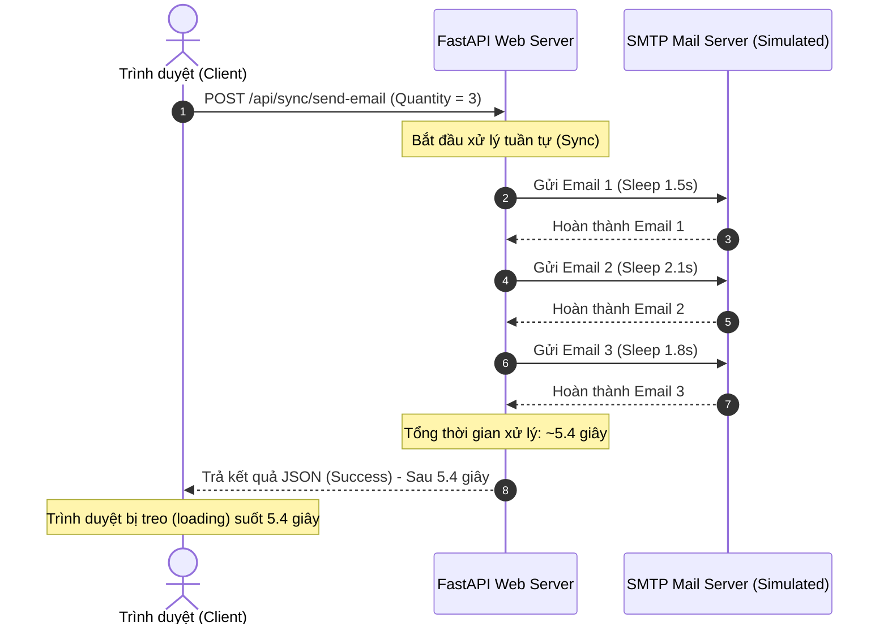
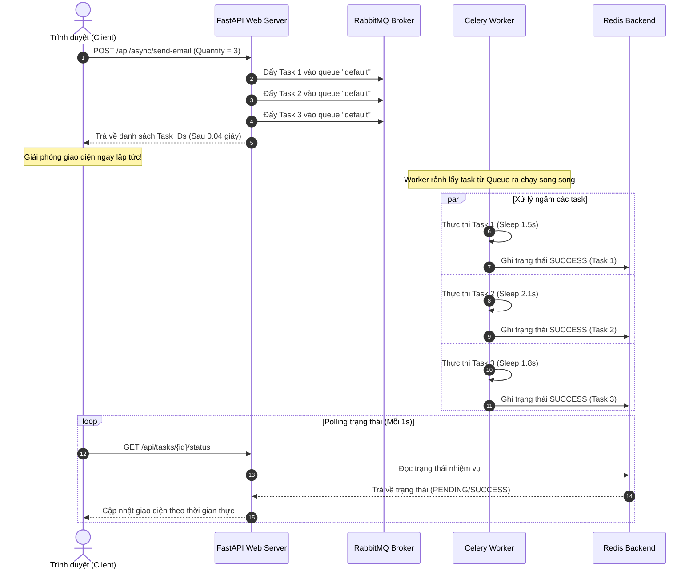

# 📊 Báo cáo Chi tiết Thực nghiệm 1 (TN1) — Đồng bộ (Sync) vs Bất đồng bộ (Async)

Báo cáo này trình bày chi tiết về mặt lý thuyết, sơ đồ hoạt động, kết quả đo lường thực tế và phân tích kỹ thuật của **Thực nghiệm 1 (TN1)** trong dự án Hệ thống Hàng đợi Tác vụ Phân tán sử dụng **Celery + RabbitMQ + Redis**.

---

## 1. Thông tin Chung về Thực nghiệm
*   **Tên Thực nghiệm**: So sánh hiệu năng giữa Xử lý Đồng bộ (Sync - Blocking) và Bất đồng bộ (Async - Non-blocking) qua Use Case gửi Email.
*   **Mục tiêu**: Chứng minh sự cải thiện vượt trội về **thời gian phản hồi của API (API Response Time)** và trải nghiệm người dùng khi chuyển đổi các tác vụ nặng (I/O Bound) sang xử lý nền (Background Processing).
*   **Tác vụ Giả lập**: Tác vụ gửi email [send_email_task](file:///e:/2026%20Year/K%C3%AC%203%20N%C4%83m%203/Ung_Dung_Phan_Tan/Project/celery-project/core/tasks.py#L28) chứa mã lệnh giả lập thời gian trễ mạng (SMTP connection delay) từ `1.0s` đến `3.0s` ngẫu nhiên cho mỗi email, kết hợp tỷ lệ lỗi ngẫu nhiên `5%` để thử nghiệm cơ chế khôi phục lỗi (Retry).

---

## 2. Quy trình & Sơ đồ Hoạt động (Workflow)

### 2.1. Chế độ Đồng bộ (Sync - Blocking)
Client gửi yêu cầu gửi $N$ email. FastAPI nhận request và gọi trực tiếp hàm xử lý. FastAPI phải đợi cho đến khi cả $N$ email được xử lý xong rồi mới trả phản hồi về cho client.

### 2.2. Chế độ Bất đồng bộ (Async - Non-blocking)
Client gửi yêu cầu gửi $N$ email. FastAPI nhận request, đóng gói thành các task message, đẩy thật nhanh vào hàng đợi **RabbitMQ**, rồi lập tức trả về mã `task_id` cho client. Các **Celery Workers** sẽ tự động lấy các task này từ RabbitMQ ra để thực thi độc lập ở chế độ ngầm.

---

## 3. Bảng Kết quả Đo lường Thực tế (Với $N = 3$ Email)

Dưới đây là bảng số liệu đo lường trực tiếp từ hệ thống:

| Tiêu chí so sánh | Chế độ Đồng bộ (Sync) | Chế độ Bất đồng bộ (Async) |
| :--- | :--- | :--- |
| **Thời gian API phản hồi** | **5.940 giây** | **0.0425 giây** |
| **Trạng thái luồng chính** | Bị nghẽn hoàn toàn (Blocking) | Được giải phóng lập tức (Non-blocking) |
| **Trải nghiệm Client** | Treo UI, biểu tượng tải xoay liên tục | Phản hồi phản xạ lập tức trong tích tắc |
| **Hiệu quả tốc độ phản hồi** | Mức cơ sở (1x) | **Tăng 139.76 lần** |
| **Nơi xử lý gửi email** | Tiến trình Web Server (FastAPI) | Tiến trình Worker ngầm (Celery Worker) |

---

## 4. Phân tích Kỹ thuật & Lý thuyết Phân tán

### 4.1. Công thức tính thời gian phản hồi ($T_{response}$)
*   **Trong chế độ Đồng bộ**:
    $$T_{sync} = \sum_{i=1}^{N} t_{processing\_i} + t_{network\_overhead}$$
    Thời gian phản hồi tỉ lệ thuận tuyến tính $O(N)$ với số lượng tác vụ. Càng nhiều email, web server càng treo lâu và có nguy cơ bị HTTP Timeout.
*   **Trong chế độ Bất đồng bộ**:
    $$T_{async} = t_{publish\_to\_broker} + t_{network\_overhead} \approx O(1)$$
    Thời gian phản hồi cực nhỏ và không đổi, hoàn toàn tách biệt khỏi thời gian xử lý thực tế của tác vụ ngầm.

### 4.2. Khả năng chịu tải (Throughput)
*   **Sync**: Do luồng xử lý bị chiếm dụng để đợi I/O, Web server sẽ nhanh chóng cạn kiệt tài nguyên (Worker threads/processes) khi có nhiều người dùng đồng thời, dẫn đến sập hệ thống (502/504 Bad Gateway).
*   **Async**: Web server chỉ đóng vai trò nhận/đẩy tin nhắn (nhẹ và nhanh), cho phép chịu tải hàng nghìn yêu cầu đồng thời mà không bị nghẽn luồng.

### 4.3. Khả năng chịu lỗi và Khôi phục (Resilience)
*   **Sync**: Nếu kết nối SMTP bị lỗi trong quá trình gửi, API sẽ lập tức báo lỗi 500 về cho client. Luồng công việc bị gián đoạn và khó khôi phục.
*   **Async**: Nhờ có Celery, khi Worker gửi email thất bại (do lỗi SMTP ngẫu nhiên 5%), Worker sẽ tự động kích hoạt cơ chế **Retry** ngầm (thử lại sau 5 giây). Người dùng hoàn toàn không biết có lỗi xảy ra và hệ thống tự khôi phục thành công.

---

## 5. Kết luận cho bài thuyết trình
> [!TIP]
> **Đúc kết ngắn gọn khi báo cáo**:
> *"Thực nghiệm 1 đã chứng minh rõ nét ưu điểm cốt lõi của Kiến trúc Task Queue. Việc chuyển đổi từ Sync sang Async giúp tăng tốc độ phản hồi API lên tới **gần 140 lần** đối với 3 email. Cơ chế này giúp tách rời (Decouple) hoàn toàn Web Server khỏi các tác vụ nặng, đảm bảo khả năng mở rộng (Scalability), tăng độ mượt mà của trải nghiệm người dùng và giúp hệ thống có khả năng tự khôi phục khi gặp lỗi mạng thông qua cơ chế tự động thử lại (Automatic Retry)."*
