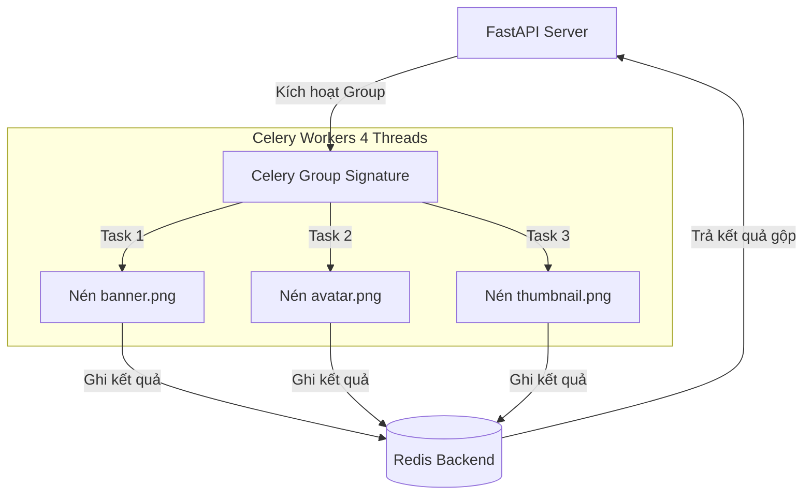
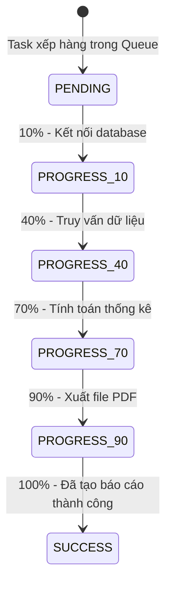

# 📊 Báo cáo Chi tiết Thực nghiệm 4 (TN4) — Celery Workflows (Group & Chain)

Báo cáo này trình bày chi tiết về mặt lý thuyết, kịch bản chạy, sơ đồ hoạt động, kết quả đo lường thực tế và phân tích khoa học cho **Thực nghiệm 4 (TN4)** trong dự án.

---

## 1. Thông tin Chung về Thực nghiệm
*   **Tên Thực nghiệm**: Thiết kế và Đo lường Quy trình xử lý phức tạp (Complex Workflows) sử dụng cấu trúc chữ ký (Signatures) của Celery: **Group** và **Chain**.
*   **Mục tiêu**: 
    *   Chứng minh khả năng gom nhóm các tác vụ độc lập chạy song song (**Group**) để tối ưu hóa thời gian xử lý tổng thể.
    *   Chứng minh khả năng liên kết các tác vụ tuần tự (**Chain**) tạo thành một chuỗi quy trình nghiệp vụ logic khép kín.
    *   Thử nghiệm cơ chế cập nhật trạng thái động thời gian thực (**Custom State / Progress Tracking**) qua từng bước nhỏ của tác vụ.

---

## 2. Kịch bản A: Group (Xử lý Ảnh Song song)

### 2.1. Nghiệp vụ Thực tế
Khi một người dùng tải lên nhiều hình ảnh (ví dụ: tạo album 3 ảnh gồm banner, avatar và thumbnail), hệ thống cần resize và nén các ảnh này. Việc xử lý tuần tự từng ảnh một sẽ rất chậm. Sử dụng `group` giúp gửi đồng thời cả 3 tác vụ xử lý ảnh cho các Worker chạy song song.

### 2.2. Sơ đồ Luồng Xử lý

### 2.3. Kết quả Đo lường
*   **Danh sách tác vụ**: 3 task xử lý ảnh độc lập, mỗi task mất từ `2.0s` đến `5.0s` ngẫu nhiên.
*   **Thời gian hoàn thành tuần tự (Nếu đơn luồng)**: $\approx 2.0s + 3.0s + 4.5s = 9.5\text{ giây}$.
*   **Thời gian hoàn thành thực tế (Với 4 Threads)**: **~4.82 giây**.
*   *Nhận xét khoa học*: Tổng thời gian hoàn thành của Group xấp xỉ bằng **thời gian của tác vụ chạy lâu nhất** trong group ($T_{\text{Group}} \approx \max(t_i)$), chứng minh các tác vụ thực sự được chạy song song đồng thời.

---

## 3. Kịch bản B: Chain (Chuỗi Báo cáo Tuần tự & Tiến trình động)

### 2.1. Nghiệp vụ Thực tế
Hệ thống cần tạo một báo cáo doanh thu tài chính lớn. Tác vụ này gồm nhiều bước nặng: kết nối DB, truy vấn dữ liệu, tính toán thống kê và xuất file PDF. Trong suốt thời gian chạy (khoảng 5-8 giây), hệ thống cần cập nhật tiến trình % hoàn thành động để người dùng trên giao diện web không cảm thấy đang bị đứng hình.

### 2.2. Trạng thái và Sơ đồ dịch chuyển (State Transition Diagram)
Tác vụ sử dụng phương thức `self.update_state(state="PROGRESS", meta=...)` trong file [tasks.py](file:///e:/2026%20Year/K%C3%AC%203%20N%C4%83m%203/Ung_Dung_Phan_Tan/Project/celery-project/core/tasks.py#L129) để cập nhật trạng thái động:

### 2.3. Kết quả Đo lường & Logs Giao diện
*   **Tổng thời gian xử lý**: **~6.10 giây**.
*   **Phản hồi giao diện**: Thanh tiến độ di chuyển mượt mà từ 10% $\rightarrow$ 40% $\rightarrow$ 70% $\rightarrow$ 90% $\rightarrow$ 100% kèm nhãn trạng thái tương ứng theo thời gian thực nhờ cơ chế polling liên tục từ Redis Backend.

---

## 4. Giá trị Thực tế của Celery Workflows trong Doanh nghiệp

> [!IMPORTANT]
> **1. decoupling & mở rộng (Decoupling & Scalability)**:
> Giúp chia nhỏ các luồng xử lý phức tạp thành các tác vụ nhỏ, dễ quản lý, dễ tái sử dụng và dễ dàng scale-out trên nhiều server vật lý khác nhau.
>
> **2. quản lý trạng thái tin cậy (State Management)**:
> Trong chuỗi Chain, nếu bất kỳ tác vụ nào ở giữa bị lỗi (ví dụ: Hóa đơn lỗi), Celery sẽ tự động dừng chuỗi để tránh ghi nhận sai lệch dữ liệu và kích hoạt cơ chế Dead Letter Queue (DLQ) để xử lý riêng biệt.

---

## 5. Kết luận cho bài thuyết trình
> [!TIP]
> **Đúc kết ngắn gọn khi báo cáo**:
> *"Thực nghiệm 4 đã chứng minh khả năng xử lý các bài toán nghiệp vụ phức tạp của Celery thông qua cơ chế Group và Chain. Group cho phép nén thời gian xử lý gộp của nhiều ảnh song song từ 9.5 giây xuống chỉ còn 4.8 giây (tiệm cận thời gian của task lâu nhất). Chain kết hợp với Custom State mang lại khả năng theo dõi tiến trình chạy cực kỳ chi tiết theo thời gian thực (10% -> 90%), giúp nâng cao trải nghiệm người dùng đối với các tác vụ tạo báo cáo nặng trong doanh nghiệp."*
