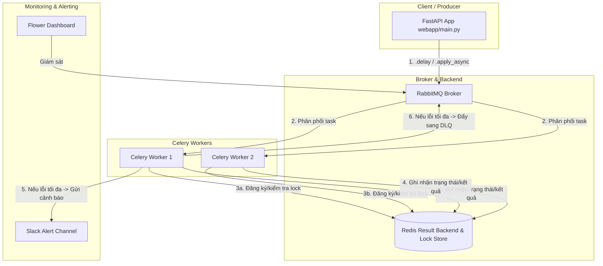

# 📋 Tổng quan Dự án Celery Distributed Task Queue

Dự án này là bài tập lớn môn **Ứng dụng Phân tán (Lớp ƯDPT-N05, Nhóm 2)** của hai thành viên **Hoàng Văn Dũng** và **Nguyễn Hữu Thành Đạt**. 
Mục tiêu của dự án là xây dựng hệ thống xử lý tác vụ bất đồng bộ và phân tán sử dụng **Celery** với **RabbitMQ** làm Message Broker và **Redis** làm Result Backend. Bên cạnh các chức năng cơ bản, hệ thống được mở rộng với 2 tính năng phân tán nâng cao: **Quản lý khóa phân tán (Distributed Lock)** và **Hàng đợi thư chết (Dead Letter Queue - DLQ) kết hợp Cảnh báo tự động qua Slack**.

---

## 🏗️ Kiến trúc & Luồng dữ liệu Hệ thống

Hệ thống hoạt động theo mô hình **Producer-Consumer** phân tán:
- **Producer (FastAPI)**: Đẩy các yêu cầu xử lý tác vụ dưới dạng tin nhắn vào **RabbitMQ**.
- **Message Broker (RabbitMQ)**: Lưu trữ các hàng đợi (queues), phân phối tin nhắn đến các Worker trống.
- **Consumers (Celery Workers)**: Lắng nghe RabbitMQ, xử lý tác vụ bất đồng bộ.
- **Result Backend (Redis)**: Lưu trữ trạng thái (`PENDING`, `STARTED`, `SUCCESS`, `FAILURE`, `PROGRESS`) và kết quả đầu ra của tác vụ.
- **Database (PostgreSQL)**: Cơ sở dữ liệu quan hệ (được thiết lập sẵn qua Docker).

### Sơ đồ luồng xử lý:



---

## 📁 Cấu trúc thư mục & Các thành phần chính

### 1. Celery Core (Cấu hình và Tác vụ cơ bản)
*   [core/main.py](file:///e:/2026%20Year/K%C3%AC%203%20N%C4%83m%203/Ung_Dung_Phan_Tan/Project/celery-project/core/main.py): Khởi tạo instance Celery và cấu hình tự động tìm kiếm tác vụ (`autodiscover_tasks`) trong toàn dự án.
*   [core/celeryconfig.py](file:///e:/2026%20Year/K%C3%AC%203%20N%C4%83m%203/Ung_Dung_Phan_Tan/Project/celery-project/core/celeryconfig.py): Cấu hình trung tâm cho Celery. Quy định các tham số như Broker URL, Result Backend, Serialization (JSON), Timezone, xác nhận tin nhắn muộn (`task_acks_late=True`), số lần thử lại mặc định, và cấu hình các queue (`default` có thiết lập DLX, `high_priority`, `low_priority`, `celery.dlq`).
*   [core/tasks.py](file:///e:/2026%20Year/K%C3%AC%203%20N%C4%83m%203/Ung_Dung_Phan_Tan/Project/celery-project/core/tasks.py): Định nghĩa 3 tác vụ cơ bản thực tế:
    *   `send_email_task`: Giả lập tác vụ I/O bound (gửi email hàng loạt, hỗ trợ retry).
    *   `process_image_task`: Giả lập tác vụ CPU bound (nén, resize ảnh).
    *   `generate_report_task`: Giả lập tạo báo cáo lớn, cập nhật trạng thái tiến trình thực tế (`self.update_state` với state `PROGRESS`).

### 2. FastAPI Web App (Producer & Thực nghiệm)
*   [webapp/main.py](file:///e:/2026%20Year/K%C3%AC%203%20N%C4%83m%203/Ung_Dung_Phan_Tan/Project/celery-project/webapp/main.py): Cung cấp các endpoint REST API:
    *   `POST /api/sync/send-email`: Gửi email đồng bộ (blocking) để đo lường thời gian phản hồi của luồng thông thường.
    *   `POST /api/async/send-email`: Gửi email bất đồng bộ thông qua Celery (non-blocking), trả về `task_id` ngay lập tức.
    *   `GET /api/tasks/{task_id}/status`: Tra cứu trạng thái và kết quả xử lý của task từ Redis.

### 3. Feature 1: Distributed Lock (Ngăn chặn Race Condition)
Khi có nhiều Celery Worker chạy song song, việc hai worker cùng xử lý một tài nguyên (ví dụ: cùng một giao dịch thanh toán) có thể dẫn tới race condition hoặc double-spending. Khóa phân tán giải quyết triệt để vấn đề này.
*   [feature1_distributed_lock/lock_manager.py](file:///e:/2026%20Year/K%C3%AC%203%20N%C4%83m%203/Ung_Dung_Phan_Tan/Project/celery-project/feature1_distributed_lock/lock_manager.py):
    *   Lớp [DistributedLock](file:///e:/2026%20Year/K%C3%AC%203%20N%C4%83m%203/Ung_Dung_Phan_Tan/Project/celery-project/feature1_distributed_lock/lock_manager.py#L14):
        *   `acquire`: Đăng ký khóa nguyên tử bằng lệnh `SET KEY VALUE NX EX TTL` của Redis.
        *   `release`: Giải phóng khóa an toàn bằng **Lua script** (chỉ xóa khóa nếu token của worker hiện tại trùng khớp, tránh xóa nhầm khóa của worker khác khi bị quá giờ).
    *   Decorator [lock_task](file:///e:/2026%20Year/K%C3%AC%203%20N%C4%83m%203/Ung_Dung_Phan_Tan/Project/celery-project/feature1_distributed_lock/lock_manager.py#L64): Bọc ngoài các Celery task để tự động hóa việc lấy/giải phóng khóa. Nếu không lấy được khóa, task có thể tự động xếp hàng lại (`retry_on_fail=True`) hoặc hủy bỏ/bỏ qua tác vụ (`Ignore()`).
*   [feature1_distributed_lock/tasks.py](file:///e:/2026%20Year/K%C3%AC%203%20N%C4%83m%203/Ung_Dung_Phan_Tan/Project/celery-project/feature1_distributed_lock/tasks.py): Định nghĩa task `process_payment_task` được áp dụng decorator `@lock_task("lock:payment:{0}")`.
*   [feature1_distributed_lock/demo.py](file:///e:/2026%20Year/K%C3%AC%203%20N%C4%83m%203/Ung_Dung_Phan_Tan/Project/celery-project/feature1_distributed_lock/demo.py): Script kịch bản demo gửi đồng thời 2 giao dịch trùng mã giao dịch để kiểm tra cơ chế chặn Race Condition của Distributed Lock.

### 4. Feature 2: Dead Letter Queue (DLQ) & Slack Alerting
Khi một task bị lỗi liên tục (vượt quá `max_retries`), nếu bỏ qua thì dữ liệu bị mất, nếu để crash liên tục sẽ gây nghẽn hàng đợi. Hệ thống sẽ tự động gửi cảnh báo và đưa tin nhắn lỗi vào Dead Letter Queue (`celery.dlq`) để điều tra sau.
*   [feature2_dlq_alerting/alerting.py](file:///e:/2026%20Year/K%C3%AC%203%20N%C4%83m%203/Ung_Dung_Phan_Tan/Project/celery-project/feature2_dlq_alerting/alerting.py): Hàm [send_slack_alert](file:///e:/2026%20Year/K%C3%AC%203%20N%C4%83m%203/Ung_Dung_Phan_Tan/Project/celery-project/feature2_dlq_alerting/alerting.py#L11) gửi thông tin lỗi chi tiết (Task Name, Task ID, Retries, Error Message) qua Slack Webhook.
*   [feature2_dlq_alerting/tasks.py](file:///e:/2026%20Year/K%C3%AC%203%20N%C4%83m%203/Ung_Dung_Phan_Tan/Project/celery-project/feature2_dlq_alerting/tasks.py): Task `process_flaky_task` tự động thử lại 3 lần. Nếu lần thứ 4 vẫn lỗi, nó sẽ gửi Slack Alert, tự đóng gói và xuất bản tin nhắn lỗi sang hàng đợi `celery.dlq` thông qua Kombu Producer, sau đó `raise Ignore()`.
*   [feature2_dlq_alerting/dlq_consumer.py](file:///e:/2026%20Year/K%C3%AC%203%20N%C4%83m%203/Ung_Dung_Phan_Tan/Project/celery-project/feature2_dlq_alerting/dlq_consumer.py): Một consumer độc lập sử dụng Kombu SimpleQueue để đọc các tin nhắn lỗi trong hàng đợi `celery.dlq`, in ra thông tin phân tích chi tiết lỗi, và xác nhận (`message.ack()`) giải phóng hàng đợi.
*   [feature2_dlq_alerting/demo.py](file:///e:/2026%20Year/K%C3%AC%203%20N%C4%83m%203/Ung_Dung_Phan_Tan/Project/celery-project/feature2_dlq_alerting/demo.py): Script kịch bản demo gửi một task lỗi, theo dõi quá trình retry của Worker, xem log cảnh báo Slack mô phỏng và chạy DLQ consumer để thu hồi tin nhắn lỗi.

### 5. Hạ tầng và Cấu hình môi trường
*   [docker-compose.yml](file:///e:/2026%20Year/K%C3%AC%203%20N%C4%83m%203/Ung_Dung_Phan_Tan/Project/celery-project/docker-compose.yml): Định nghĩa 3 dịch vụ cơ sở hạ tầng chạy bằng Docker:
    1.  `rabbitmq`: RabbitMQ Broker (port `5672` và Management UI port `15672`).
    2.  `redis`: Redis Store (port `6379`).
    3.  `postgres`: PostgreSQL Database (ánh xạ port `5433:5432` để tránh trùng với Postgres local).
*   [.env.example](file:///e:/2026%20Year/K%C3%AC%203%20N%C4%83m%203/Ung_Dung_Phan_Tan/Project/celery-project/.env.example): Chứa cấu hình các thông số môi trường mặc định như thông tin đăng nhập RabbitMQ, URL kết nối Redis, PostgreSQL và URL Slack Webhook.

---

## 🚀 Hướng dẫn Vận hành & Chạy thử nghiệm

Để chạy dự án trên máy Windows, bạn thực hiện theo các bước sau:

### Bước 1: Chuẩn bị môi trường
1.  Tạo file `.env` từ file ví dụ:
    ```powershell
    copy .env.example .env
    ```
2.  Khởi động các dịch vụ Docker (RabbitMQ, Redis, Postgres):
    ```powershell
    docker compose up -d
    ```
3.  Cài đặt các thư viện Python:
    ```powershell
    python -m venv venv
    .\venv\Scripts\activate
    pip install -r requirements.txt
    ```

### Bước 2: Chạy Celery Worker & Flower (Giám sát)
*   **Chạy Celery Worker** (sử dụng pool `threads` trên Windows để tránh lỗi phân quyền process):
    ```powershell
    .\venv\Scripts\celery.exe -A core.main worker --loglevel=info --pool=threads
    ```
*   **Chạy Flower Dashboard**:
    ```powershell
    .\venv\Scripts\celery.exe -A core.main flower --port=5555
    ```
    *Xem trạng thái Worker và Task trực quan tại:* `http://localhost:5555`

### Bước 3: Chạy ứng dụng FastAPI Web Server
```powershell
.\venv\Scripts\uvicorn.exe webapp.main:app --reload --port=8000
```
*Truy cập Swagger UI của API tại:* `http://localhost:8000/docs`

### Bước 4: Chạy các kịch bản thực nghiệm & demo
*   **Demo Tính năng 1 (Distributed Lock)**:
    ```powershell
    python feature1_distributed_lock/demo.py
    ```
*   **Demo Tính năng 2 (Dead Letter Queue & Alerting)**:
    ```powershell
    python feature2_dlq_alerting/demo.py
    ```
