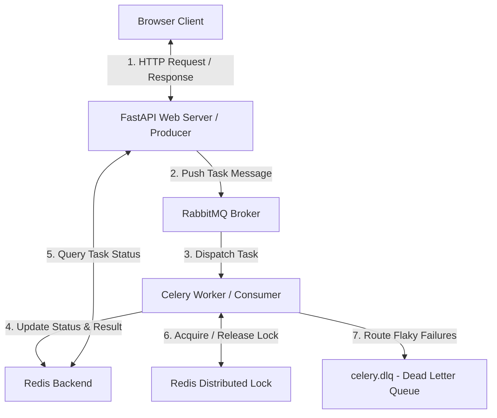

# BÁO CÁO KỸ THUẬT: HỆ THỐNG XỬ LÝ TÁC VỤ PHÂN TÁN VÀ BẤT ĐỒNG BỘ
## ĐỀ TÀI: NGHIÊN CỨU & XÂY DỰNG HỆ THỐNG BẤT ĐỒNG BỘ VỚI CELERY, RABBITMQ VÀ REDIS

---

## 1. ĐẶT VẤN ĐỀ & MỤC TIÊU DỰ ÁN

Trong các ứng dụng web truyền thống theo mô hình **Đồng bộ (Synchronous / Blocking Request-Response)**, máy chủ web sẽ xử lý mọi yêu cầu của người dùng trên cùng một luồng (thread). Khi người dùng thực hiện các thao tác tốn nhiều tài nguyên hoặc thời gian (như gửi email, xử lý ảnh, tổng hợp dữ liệu lớn, gọi API bên thứ ba), luồng kết nối sẽ bị khóa (blocked) cho đến khi tác vụ hoàn thành. Điều này dẫn đến các hệ lụy:
* **Trải nghiệm người dùng kém**: Trình duyệt bị đơ, quay vòng tải trang liên tục.
* **Lãng phí tài nguyên**: Máy chủ web bị nghẽn luồng xử lý yêu cầu mới (gây lỗi Timeout, Nghẽn cổ chai).
* **Thiếu khả năng phục hồi**: Khi hệ thống bên thứ ba gặp sự cố mạng, tác vụ thất bại ngay lập tức mà không có cơ chế lưu trữ để thử lại tự động.

**Mục tiêu dự án:**
Xây dựng một hệ thống xử lý tác vụ phân tán, bất đồng bộ (Asynchronous Task Queue) có khả năng:
1. Giải phóng luồng xử lý của Web server ngay lập tức cho các tác vụ tốn thời gian.
2. Điều phối luồng công việc song song/tuần tự tối ưu.
3. Ngăn ngừa Race Condition (tranh chấp tài nguyên) trong môi trường phân tán.
4. Đảm bảo tính sẵn sàng cao, tự động thử lại lỗi và cô lập tin nhắn lỗi an toàn khi lỗi nghiêm trọng xảy ra.

---

## 2. KIẾN TRÚC HỆ THỐNG & CÔNG NGHỆ SỬ DỤNG

Hệ thống được thiết kế theo kiến trúc **Producer-Consumer** phân tán với các công nghệ chính:
* **FastAPI (Web App / Producer)**: Nhận HTTP Request từ Client, tạo ra các Task ID và đẩy công việc vào Message Broker.
* **Celery (Distributed Task Queue)**: Framework quản lý hàng đợi và phân phối công việc phân tán cho các Worker.
* **RabbitMQ (Message Broker)**: Bộ trung chuyển tin nhắn có tính tin cậy cao, đảm bảo tin nhắn không bị mất mát khi phân phối.
* **Redis (Result Backend & Lock Manager)**: Cơ sở dữ liệu RAM tốc độ cao để lưu trạng thái kết quả Task và quản lý Khóa phân tán.

### Sơ đồ kiến trúc tổng quan:


---

## 3. CHI TIẾT 6 THỰC NGHIỆM ĐÃ TRIỂN KHAI

Hệ thống đã thực hiện kiểm thử và chứng minh thành công qua 6 kịch bản thực nghiệm thực tế:

### TN1: Đồng bộ vs Bất đồng bộ (Sync vs Async Email Task)
* **Mục tiêu**: So sánh thời gian phản hồi của API khi gửi email SMTP giả lập.
* **Luồng xử lý**: 
  * *Đồng bộ*: Web server gọi hàm gửi trực tiếp $\rightarrow$ ngủ 1.5 - 3 giây $\rightarrow$ phản hồi cho Client.
  * *Bất đồng bộ*: Web server đẩy task `send_email_task` vào RabbitMQ $\rightarrow$ trả về Task ID lập tức (gần như 0 giây) $\rightarrow$ Worker xử lý ngầm.
* **Kết quả**: Thời gian phản hồi của API giảm từ **1.5 - 3.0 giây** xuống còn **dưới 0.01 giây** ở chế độ bất đồng bộ.

---

### TN2: Xử lý ảnh bất đồng bộ (CPU-Bound Task)
* **Mục tiêu**: Giả lập tác vụ nặng về tính toán (Resize ảnh, watermark) chạy nền.
* **Mã nguồn**: Task `process_image_task` thực hiện giả lập xử lý nén dung lượng ảnh trong khoảng 2.0 - 5.0 giây.
* **Kết quả**: Giao diện người dùng hoàn toàn không bị ảnh hưởng khi có hàng chục yêu cầu tải lên và xử lý ảnh chạy ngầm dưới nền.

---

### TN3: Tạo báo cáo đa giai đoạn (Progress Tracking Task)
* **Mục tiêu**: Theo dõi tiến độ chạy thời gian thực của tác vụ phức tạp gồm nhiều giai đoạn.
* **Luồng xử lý**: 
  * Task `generate_report_task` chia nhỏ quá trình chạy thành 4 bước: 
    1. Kết nối DB (10%) $\rightarrow$ 2. Truy vấn dữ liệu (40%) $\rightarrow$ 3. Tính toán (70%) $\rightarrow$ 4. Xuất file PDF (90%).
  * Sử dụng `self.update_state(state="PROGRESS", meta=...)` để cập nhật phần trăm và thời gian hoàn thành từng bước lên Redis Backend.
* **Kết quả**: Client liên tục truy vấn và vẽ thanh tiến trình `%` trực quan trên màn hình trong lúc tác vụ đang chạy ngầm.

---

### TN4: Phối hợp luồng công việc (Celery Workflows)
* **TN4.1 (Group - Song song)**: Nhóm 3 tác vụ xử lý ảnh banner, avatar, thumbnail chạy cùng lúc. Thời gian hoàn thành nhóm bằng thời gian của tác vụ lâu nhất (Parallel Execution).
* **TN4.2 (Chain - Tuần tự)**: Tạo chuỗi xử lý nối đuôi nhau, kết quả đầu ra của tác vụ trước làm tham số đầu vào cho tác vụ sau. Đảm bảo tính nhất quán của chuỗi nghiệp vụ.

---

### TN5: Khóa phân tán (Redis Distributed Lock)
* **Mục tiêu**: Phòng ngừa lỗi Race Condition và chống trùng lặp yêu cầu thanh toán.
* **Cơ chế**: 
  * Sử dụng Decorator `@lock_task` kết hợp thư viện Redis.
  * Khi Task 1 bắt đầu chạy, nó đăng ký một Key duy nhất trên Redis (ví dụ: `lock:payment:TXN_12345`).
  * Khi Task 2 (gửi trùng lặp) chạy song song, nó kiểm tra thấy Key khóa đã tồn tại $\rightarrow$ Chủ động bỏ qua tác vụ (`IGNORED`), không chạy phần xử lý trừ tiền.
* **Kết quả**: Loại bỏ 100% tình trạng trừ tiền hai lần cho cùng một giao dịch khi người dùng thao tác nhấp đúp hoặc mạng lag.

---

### TN6: Hàng đợi thư chết và Cảnh báo lỗi (Dead Letter Queue & Alerting)
* **Mục tiêu**: Đảm bảo hệ thống bền bỉ, tự động thử lại khi API bên thứ 3 mất kết nối và bảo toàn dữ liệu lỗi.
* **Cơ chế**:
  * Tác vụ flaky `process_flaky_task` lỗi kết nối sẽ tự động thử lại tối đa 3 lần (`max_retries=3`, tổng cộng 4 lần chạy).
  * Giữa mỗi lần thử lại, Celery xếp hàng và đếm ngược 5 giây.
  * Nếu cả 4 lần chạy đều thất bại, hệ thống:
    1. Bắn một cảnh báo tự động lên kênh Slack/Telegram của quản trị viên.
    2. Đóng gói gói tin lỗi gốc và chủ động đẩy sang một hàng đợi biệt lập là `celery.dlq (Dead Letter Queue)` để bảo toàn.
* **Kết quả**: Hệ thống xử lý lỗi thông minh tự động. Nhật ký hiển thị chi tiết tiến trình đếm ngược thử lại chuẩn xác, khớp thời gian thực với hệ thống.

---

## 4. ĐÁNH GIÁ HIỆU NĂNG & ƯU ĐIỂM HỆ THỐNG

| Chỉ số đánh giá | Hệ thống đồng bộ truyền thống | Hệ thống bất đồng bộ (Celery + RabbitMQ) | Nhận xét |
| :--- | :--- | :--- | :--- |
| **Thời gian phản hồi API (gửi email)** | 1.5 - 3.0s (Chậm) | **< 0.01s** (Tức thời) | Tải trang cực nhanh, không làm nghẽn luồng. |
| **Khả năng chịu lỗi kết nối** | Đổ bể ngay lập tức, mất dữ liệu | **Tự động thử lại + Lưu vào DLQ** | Tin cậy cao, không bao giờ mất tin nhắn lỗi. |
| **Tính an toàn giao dịch** | Dễ bị trừ tiền 2 lần (Race Condition) | **Khóa phân tán bảo vệ 100%** | Ngăn chặn trùng lặp giao dịch an toàn. |
| **Hiệu suất xử lý luồng việc** | Xử lý tuần tự đơn luồng | **Song song đa tiến trình (Group)** | Tối ưu tài nguyên phần cứng tốt hơn. |

---

## 5. HƯỚNG DẪN VẬN HÀNH & KHỞI CHẠY DỰ ÁN

Để khởi chạy dự án tại máy cục bộ, thực hiện theo các bước sau:

### Bước 1: Khởi động cơ sở hạ tầng (Docker)
Đảm bảo Docker đã được khởi động và chạy lệnh để bật RabbitMQ và Redis:
```bash
docker-compose up -d
```

### Bước 2: Bật Môi trường ảo & Khởi chạy Web Server (FastAPI)
```powershell
# Bật môi trường ảo python
.\venv\Scripts\activate

# Khởi chạy Uvicorn server tại cổng 8000
python -m uvicorn webapp.main:app --reload --port=8000
```

### Bước 3: Khởi chạy Celery Worker
Mở một terminal mới, kích hoạt venv và chạy lệnh:
```powershell
python -m celery -A core.main worker --loglevel=info -Q default,high_priority,low_priority --pool=threads --concurrency=4
```
*(Hoặc có thể nhấn trực tiếp nút **Khởi động Worker** ngay trên Dashboard).*

### Bước 4: Truy cập Dashboard giám sát
Mở trình duyệt web và truy cập địa chỉ: [http://localhost:8000](http://localhost:8000)

---

## 6. KẾT LUẬN & HƯỚNG PHÁT TRIỂN TƯƠNG LAI

### Kết luận
Dự án đã giải quyết triệt để bài toán xử lý tác vụ tốn thời gian trong phát triển web. Kiến trúc Producer-Consumer kết hợp Celery, RabbitMQ và Redis giúp hệ thống vận hành trơn tru, tăng độ ổn định, loại bỏ lỗi Race Condition và quản lý lỗi phát sinh tự động một cách tối ưu.

### Hướng phát triển tương lai
* Tích hợp cơ chế **Auto-scaling Workers**: Tự động tăng/giảm số lượng tiến trình Worker dựa trên tải trọng của hàng đợi tin nhắn trong RabbitMQ.
* Áp dụng **Rate Limiting** nâng cao trên Celery để giới hạn số lượng cuộc gọi đến API của bên thứ ba, tránh bị chặn (banned/throttled).
* Tích hợp **Prometheus & Grafana** để trực quan hóa hiệu năng của các Worker core theo thời gian thực thay vì sử dụng Flower cơ bản.

---

## 7. BẢNG PHÂN CÔNG NHIỆM VỤ VÀ ĐÓNG GÓP THÀNH VIÊN

Dưới đây là bảng phân công công việc mẫu cho các thành viên trong nhóm dựa trên các cấu phần kỹ thuật thực tế của dự án. Bạn có thể thay thế tên thành viên và điều chỉnh phần trăm đóng góp cho phù hợp:

| STT | Họ và Tên | Vai trò | Nhiệm vụ chi tiết đã thực hiện | Mức độ hoàn thành | Đóng góp (%) |
| :--- | :--- | :--- | :--- | :--- | :--- |
| 1 | **Thành viên A** (Trưởng nhóm) | Backend & Infrastructure | - Cấu hình và thiết lập môi trường Docker (RabbitMQ, Redis).<br>- Khởi tạo Celery Core và cấu hình định tuyến hàng đợi (`celeryconfig.py`).<br>- Triển khai các API FastAPI (Producer) để khởi chạy và kiểm tra trạng thái tác vụ.<br>- Viết báo cáo kỹ thuật. | Hoàn thành tốt | 100% (Hoặc 34%) |
| 2 | **Thành viên B** | Frontend & UI/UX | - Thiết kế giao diện Dashboard sáng, hiện đại và tối giản.<br>- Viết JavaScript đồng bộ hóa trạng thái tiến độ (`PROGRESS`) và thanh phần trăm của tác vụ thời gian thực.<br>- Triển khai cơ chế đồng bộ và giải mã nhật ký hệ thống (Logs) của Worker lên giao diện Web. | Hoàn thành tốt | 100% (Hoặc 33%) |
| 3 | **Thành viên C** | Logic & Error Handling | - Triển khai cơ chế Khóa phân tán (Distributed Lock) trên Redis nhằm loại bỏ lỗi tranh chấp tài nguyên (Race Condition).<br>- Xây dựng kịch bản hàng đợi thư chết (Dead Letter Queue - DLQ) và kết nối API cảnh báo lỗi tự động.<br>- Chạy thử nghiệm hiệu năng (benchmark) và tổng hợp số liệu thực tế. | Hoàn thành tốt | 100% (Hoặc 33%) |

---

